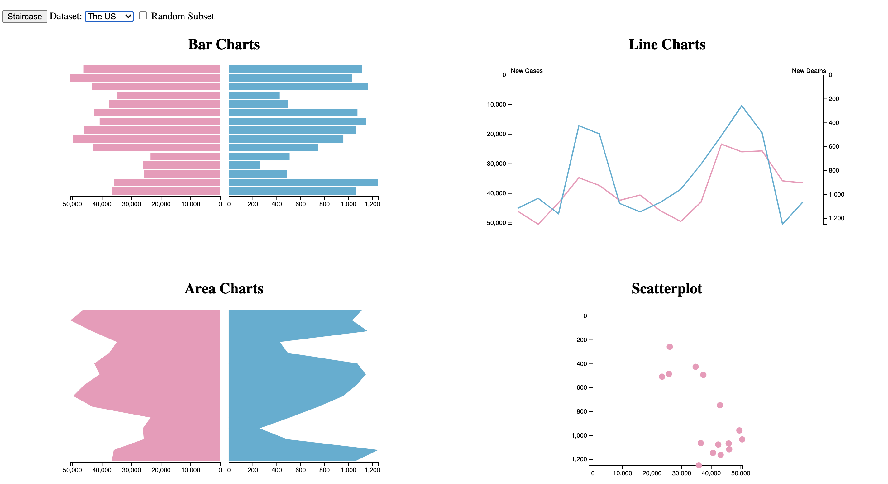
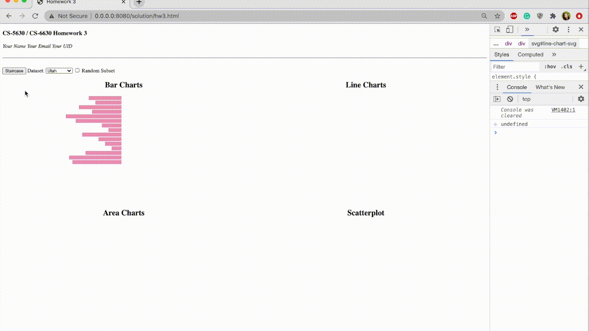

# CS-5630 / CS-6630 Homework 3

_Due: Friday, September 18, 11:59 pm._

In this assignment, you will make interactive charts with JavaScript and D3 to explore Covid-19 data.

## Implementation

We have provided boilerplate code in [hw3.html](hw3.html) and in [script.js](script.js).

As in previous homeworks, add your name, your e-mail address, and your uID to the HTML elements at the top. Also, make sure your submission is a valid HTML5 file. Check that it is valid by uploading it to the [W3C HTML Validator](https://validator.w3.org/#validate_by_upload). Also, you _must use proper D3 data binding and positioning/styling in a declarative way, whenever you're instructed to use D3_ to receive full credit.

Your project structure should look like this:

    hw3/
        hw3.html
        README.md
        script.js
        data/
            covid_us.csv
            covid_utah.csv
            covid_ca.csv
            covid_ny.csv
        figures/

Remember, to be able to access the data files with JavaScript, you will need to be _serving_ the `hw3` directory, not just opening the HTML file in a browser. If your development environment doesn't already launch a server for you, you can start one with one of these commands:

    $ cd path/to/hw3
    # for python 2
    $ python -m SimpleHTTPServer 8080
    # for python 3
    $ python -m http.server 8080

You can then view the page at [http://0.0.0.0:8080/](http://0.0.0.0:8080/)

## Part I: Basic Events

In the boilerplate HTML we provide three controls: a “Staircase” `button`, a “Select” menu for choosing a dataset, and a “Random Subset” `checkbox`.

We have **not** linked the HTML file with the new `script.js` file; your first task is to add this link, and then make the “Staircase” button call the `staircase()` function in `script.js` on click.

You should also take this opportunity to make both the `select` menu and the the “Random Subset” `checkbox` (either when checked or unchecked) call the `changeData()` function to update the data. You won't be implementing these functions immediately, however.

## Part II: JavaScript

Now that `staircase()` is being called, let's make it do something. Fill out the stub so that the existing rectangles in the first bar chart look like this, **only using JavaScript and the DOM API** (no D3 yet!):

_Hint: you will probably want to add an `id` to the group containing the first bar chart to make it easy to select and iterate through its children._

## Part III: Reshaping Things with D3

Now we're going to start using data to reshape things. We've given you the code that loads and parses the CSV data depending on which option the user selects. D3 reshapes the CSV file into an array of JavaScript objects, each with a `cases` and `deaths` parameter.

Note that we have **not** included d3.js for you; make sure to add this to your HTML as well (you can use their direct link, or you can download the library and save it in your project directory – either is acceptable).

The bulk of this assignment is to adjust the existing SVG elements based on the data. We have provided the scale functions that you will need, but it would still be a good idea to look closely at the syntax that creates each scale function. Feel free to adjust these mappings to your taste.

We have also provided examples of D3's line and area generator functions; when called with a list of JavaScript objects with a `cases` parameter, they each produce a `path` string.

_Hint: We provide you `id`s for some elements to make it easier for you to select and attach `.data()`. You can also add `id`s to other elements as long as you feel necessary._

When you are finished implementing this section of the code, changing the dataset `select` menu should reshape all of the plots to fit whichever dataset was picked.

### Scatterplot:

In this homework, your scatterplot should have an X and Y axis with proper tick marks, with X coordinates representing the number of cases and Y coordinates representing the number of deaths. You can use d3 axes functions for implementing this part of the homework. You can reuse the scales from earlier.

Your final result should look somewhat like this:

## Part IV: More Events

We focus on interactivity in this class; you will usually implement interactivity with JavaScript.

First, make any bar in either bar chart change color when the mouse hovers over it **using JavaScript**. We could accomplish this with a hover effect using CSS. However, this has some limitations, e.g. it can't be used to trigger synchronized highlighting in other views.

Your second interactive component will be to use D3 to listen for clicks on each scatterplot point - when clicked, the browser should log the x and y coordinates of that point to the console.

**Extra credit 1:** instead of just dumping the coordinates to the console on clicks, display the coordinates in a tooltip when the mouse hovers over the points. We recommend that you use the [SVG title element](https://developer.mozilla.org/en-US/docs/Web/SVG/Element/title) for that.

## Part V: Creating New / Removing Old Elements

Obviously, you don't want to go through hard-coding every element. Your next task is to remove and add elements as needed. You will only need to add to the code that reshapes the bar charts and the scatterplot; the line and area charts should already handle the different data sizes.

The first check of the “Random Subset” checkbox will (likely) send a smaller dataset to the `update` function; the first thing you should do is remove elements that are no longer needed (D3 refers to this as the `exit()` subselection).

Once that is working, you should add new elements in case “Random Subset” is unchecked again and needs to add back bars or points that you previously removed. D3 refers to the set of elements that do not yet exist as the `enter()` subselection. Remember that, as these elements are new, you will need to use D3 to set the non-data attributes as well (such as `circle` radius).

Usually, when you create a visualization with D3, you will start with this `enter()` subselection of non-existent elements - this can be particularly confusing when you're starting out with D3. Always remember to pay attention to whether you are adjusting **all** the nodes in a selection, or just the new `enter()` ones.

_Hint: You can use any D3 data binding method (e.g., `join()`)to do this!_

## Extra Credit 2: Transitions

D3 makes transitions very simple; for extra credit, animate each D3 transition (gradually change sizes, positions, and shapes when switching datasets, and fade new and old items with opacity). As we will learn later in the course, animation is _very_ attention-grabbing; make sure your animations are tasteful and subtle. 

## Demo

Here is a demo of how the interactions could look like. You can also check out a higher resolution version [here](figures/hw3_demo.mp4).

## Grading

Your score on this assignment will be as follows:

5%: The buttons / select menu trigger the appropriate functions.  
15%: The staircase button correctly reshapes the first bar chart, without using D3.  
30%: All charts change in response to changing the dataset menu.  
5%: All bar chart bars temporarily change color when hovered.  
5%: X and Y coordinates are logged to the console when clicked in the scatterplot (without requiring dataset switch).  
20%: Elements are removed when "Random Subset" loads a smaller dataset.  
20%: Elements are created and styled appropriately when "Random Subset" loads a larger dataset.  
5%: Extra Credit 1: Hovering over a point in the scatterplot shows a tooltip with the x and y data values.  
5%: Extra Credit 2: All D3 transitions are animated **tastefully**.
